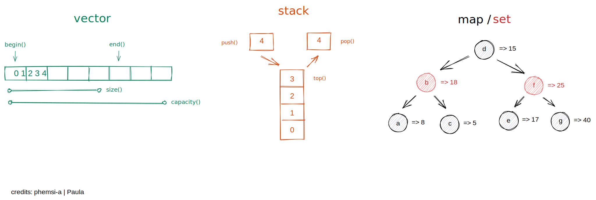
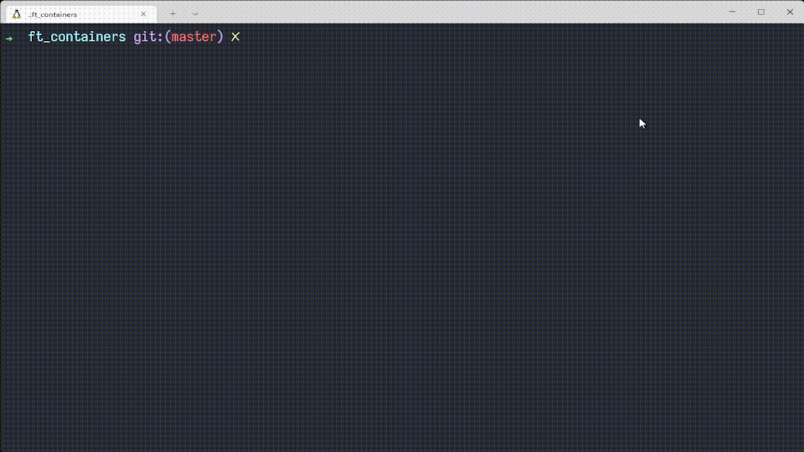
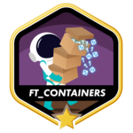

# ft_containers
The multiple available [containers in C++](https://www.cplusplus.com/reference/stl/) all have a very different usage. To understand them better and know under what circumstances to use them, nothing better than reimplementing them all.



### What is ft_containers?
Ft_containers is an individual project at [42](42sp.org.br) which requires that we reimplement some of the main [C++](https://en.wikipedia.org/wiki/C%2B%2B) Standard Template Library Containers ([C++ STL containers](https://docs.microsoft.com/en-us/cpp/standard-library/stl-containers?view=msvc-170)). The [containers](https://www.cplusplus.com/reference/stl/) to be implemented including bonus are the [vector](https://www.cplusplus.com/reference/vector/vector/), [map](https://www.cplusplus.com/reference/map/map/), [set](https://www.cplusplus.com/reference/set/set/) and [stack](https://www.cplusplus.com/reference/stack/stack/). We also need to implement the [iterators](https://www.cplusplus.com/reference/iterator/RandomAccessIterator/) when available, [iterator_traits](https://www.cplusplus.com/reference/iterator/iterator_traits/) and [reverse_iterator](https://en.cppreference.com/w/cpp/iterator/reverse_iterator). Even though [C++11](https://en.wikipedia.org/wiki/C%2B%2B11) [enable_if](https://www.cplusplus.com/reference/type_traits/enable_if/) is expected, along with [is_integral](https://www.cplusplus.com/reference/type_traits/is_integral/), [equal](https://www.cplusplus.com/reference/algorithm/equal/) and/or [lexicographical_compare](https://www.cplusplus.com/reference/algorithm/lexicographical_compare/), [std::pair](https://www.cplusplus.com/reference/utility/pair/) and [std::make_pair](https://www.cplusplus.com/reference/utility/make_pair/). The pair is used to store the data in the [map](https://www.cplusplus.com/reference/map/map/).
The [vector](https://www.cplusplus.com/reference/vector/vector/) must use a dynamically allocated array and the [stack](https://www.cplusplus.com/reference/stack/stack/) the student's [vector](https://www.cplusplus.com/reference/vector/vector/). The [map](https://www.cplusplus.com/reference/map/map/) can be implemented with an [AVL Tree](https://en.wikipedia.org/wiki/AVL_tree) or [Red-black tree](https://en.wikipedia.org/wiki/Red%E2%80%93black_tree) and the set must use a [Red-black tree](https://en.wikipedia.org/wiki/Red%E2%80%93black_tree).

### Red–black tree


### Badge


#### Skills
- Object-oriented programming
- Rigor

#### My grade


## Getting started
**Follow the steps below**
```bash
# Clone the project and access the folder
git clone https://github.com/wwwwelton/ft_containers && cd ft_containers/

# Run make so you can build the program
make

# Run the program, look at main.cpp for examples
./ft_container

# Run vector test suite
make vector1
make vector2
make vector3

# Run pair test suite
make pair1
make pair2

# Run stack test suite
make stack1
make stack2
make stack3

# Run map test suite
make map1
make map2
make map3

# Run set test suite
make set1
make set2
make set3

# Clean output objects with
make fclean

# Well done!
```

## Updating

The project is regularly updated with bug fixes and code optimization.

## 📝 License

This project is licensed under the GNU General Public License v3.0 - see the [LICENSE](LICENSE) file for details.

---

Made by: Welton Leite 👋 [See my linkedin](https://www.linkedin.com/in/welton-leite-b3492985/)
